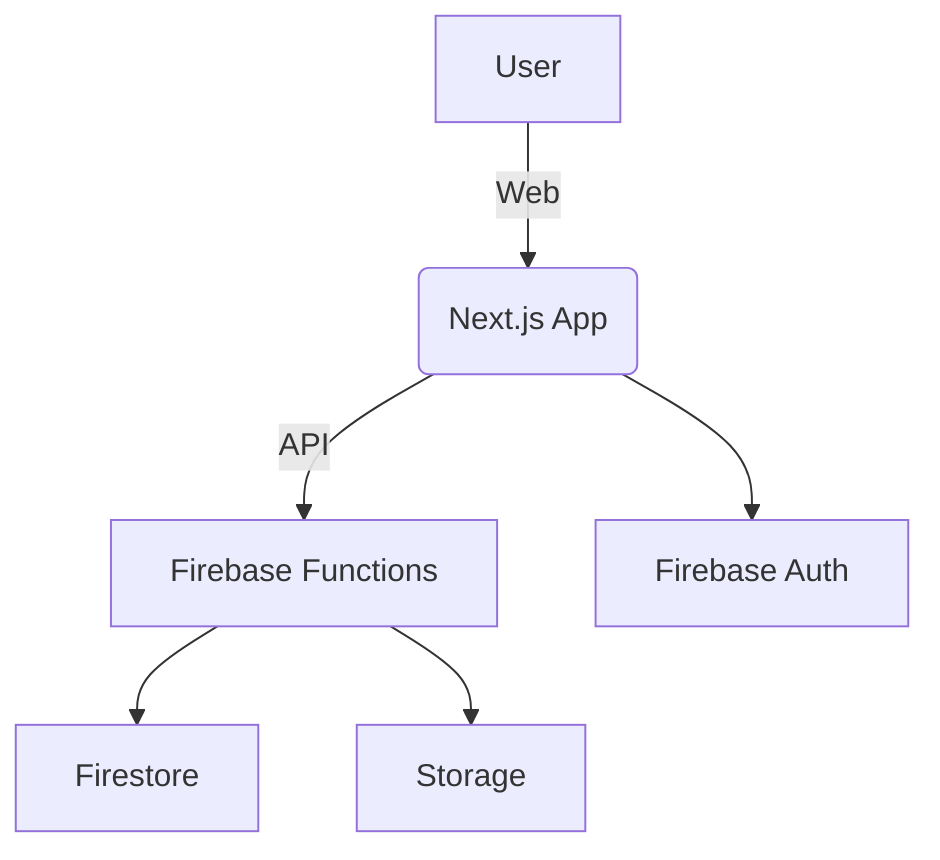
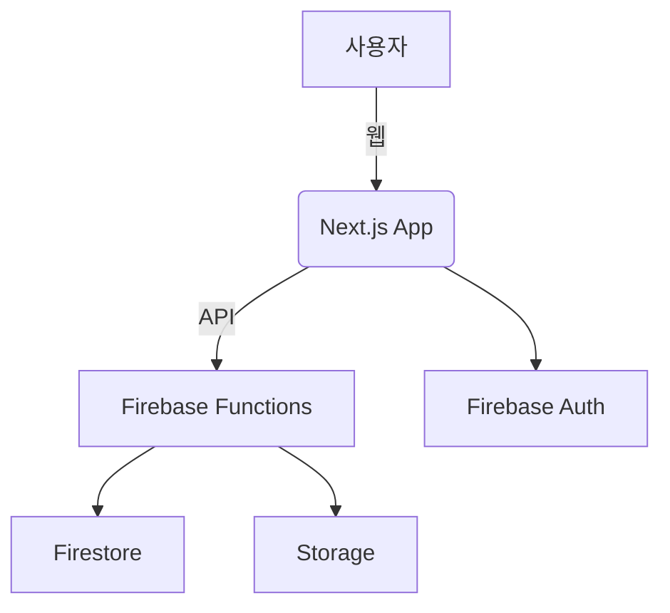

<!-- 언어 선택 / Language Switch -->
<p align="right">
  <a href="#english-version">English</a> | <a href="#한국어-버전">한국어</a>
</p>

<!-- 대표 배너 -->
<p align="center">
  
</p>

<h1 align="center">ANTI-ADHD</h1>
<p align="center">Productivity Matrix & Team Collaboration Tool</p>

<p align="center">
  
  
  
  
  
  
</p>

---

## <a id="english-version"></a>🇺🇸 English Version

### 🗂️ Project Architecture



---

### 🛠️ Tech Stack

<p align="center">
  
  
  
  
  
  
</p>

---

### 📊 GitHub Language Stats

<p align="center">
  
</p>

---

### 🗺️ ERD / Database Structure

- [View Full ERD](https://www.erdcloud.com/d/9grBEmjMs3Q7WXasL)
<p align="center">
  
</p>

---

### ✨ Main Features

- **Matrix View**: 4-quadrant priority management, drag & drop, real-time sync
- **Pomodoro Timer**: Custom sessions, statistics, break reminders
- **Team Collaboration**: Real-time chat, role management, project invites
- **Calendar Integration**: Schedule management, deadlines, reminders
- **Task Management**: Create/edit/delete, priority, due date, category

---

### 🚀 Getting Started

```bash
git clone https://github.com/octxxiii/AntiADHD.git
cd AntiADHD
pnpm install
pnpm dev
```

---

### 📄 Documentation

- [Technical Design](https://github.com/octxxiii/AntiADHD/blob/main/docs/TECHNICAL_DESIGN.md)
- [Architecture](https://github.com/octxxiii/AntiADHD/blob/main/docs/ARCHITECTURE.md)
- [API Documentation](https://github.com/octxxiii/AntiADHD/blob/main/docs/API.md)
- [Implementation Details](https://github.com/octxxiii/AntiADHD/blob/main/docs/IMPLEMENTATION.md)
- [Roadmap](https://github.com/octxxiii/AntiADHD/blob/main/docs/ROADMAP.md)
- [Deployment Guide](https://github.com/octxxiii/AntiADHD/blob/main/docs/DEPLOYMENT.md)

---

### 🤝 Contributing & License

- [CONTRIBUTING.md](https://github.com/octxxiii/AntiADHD/blob/main/docs/CONTRIBUTING.md)
- [LICENSE](https://github.com/octxxiii/AntiADHD/blob/main/docs/LICENSE.md)

---

### 📨 Contact

- Email: your@email.com
- GitHub Issues: [here](https://github.com/octxxiii/AntiADHD/issues)

---

## <a id="한국어-버전"></a>🇰🇷 한국어 버전

### 🗂️ 프로젝트 아키텍처



---

### 🛠️ 기술 스택

<p align="center">
  
  
  
  
  
  
</p>

---

### 📊 GitHub 사용 언어 통계

<p align="center">
  
</p>

---

### 🗺️ ERD / 데이터베이스 구조

- [ERD 전체 보기](https://www.erdcloud.com/d/9grBEmjMs3Q7WXasL)
<p align="center">
  
</p>

---

### ✨ 주요 기능

- **매트릭스 뷰**: 4분할 우선순위 관리, 드래그&드롭, 실시간 동기화
- **포모도로 타이머**: 커스텀 세션, 통계, 휴식 알림
- **팀 협업**: 실시간 채팅, 역할 관리, 프로젝트 초대
- **캘린더 연동**: 일정 관리, 마감일, 알림
- **태스크 관리**: 생성/수정/삭제, 우선순위, 마감일, 카테고리

---

### 🚀 빠른 시작

```bash
git clone https://github.com/octxxiii/AntiADHD.git
cd AntiADHD
pnpm install
pnpm dev
```

---

### 📄 문서

- [기술 설계](https://github.com/octxxiii/AntiADHD/blob/main/docs/TECHNICAL_DESIGN.md)
- [아키텍처](https://github.com/octxxiii/AntiADHD/blob/main/docs/ARCHITECTURE.md)
- [API 문서](https://github.com/octxxiii/AntiADHD/blob/main/docs/API.md)
- [구현 상세](https://github.com/octxxiii/AntiADHD/blob/main/docs/IMPLEMENTATION.md)
- [로드맵](https://github.com/octxxiii/AntiADHD/blob/main/docs/ROADMAP.md)
- [배포 가이드](https://github.com/octxxiii/AntiADHD/blob/main/docs/DEPLOYMENT.md)

---

### 🤝 기여 & 라이선스

- [CONTRIBUTING.md](https://github.com/octxxiii/AntiADHD/blob/main/docs/CONTRIBUTING.md)
- [LICENSE](https://github.com/octxxiii/AntiADHD/blob/main/docs/LICENSE.md)

---

### 📨 문의

- 이메일: your@email.com
- GitHub Issues: [바로가기](https://github.com/octxxiii/AntiADHD/issues)

---

> 최신 정보와 다이어그램, 이미지, 통계 등 추가 요청은 언제든 환영합니다!