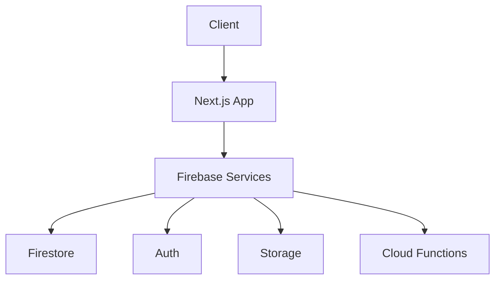
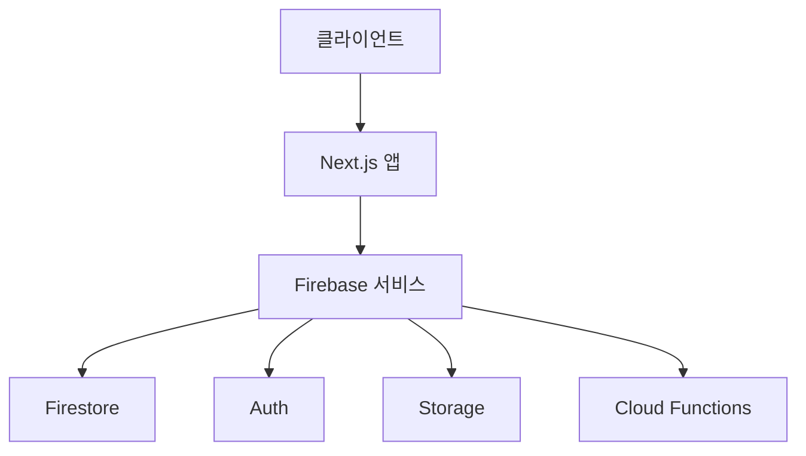

<!-- Language Switch -->
<p align="right">
  <a href="#english-version">English</a> | <a href="#한국어-버전">한국어</a>
</p>

<!-- Banner & Slogan -->
<p align="center">
  
</p>

# 🧠 ANTI-ADHD

## 🇺🇸 Introduction

**ANTI-ADHD** is a task management tool based on the Eisenhower Matrix, designed especially for users with ADHD.  
It helps you manage your tasks effectively by importance and urgency.

---

### Motivation
> **Bringing order to your chaos, clarity to your uncertainty.**

I deeply understand how challenging life with ADHD can be.  
Ideas flash by, tasks are left unfinished, and time slips through your fingers like sand.  
This project is more than just a tool—it's a dedicated companion to help you realize your full potential.

---

### Problems I Want to Solve
- ⚠️ **Difficulty prioritizing tasks**
- 🔄 **Loss of focus when switching tasks**
- ⏳ **Tendency to procrastinate important work**
- 📊 **Excessive multitasking**
- ⏰ **Struggles with time management**
- 📝 **Difficulty planning daily routines**

---

### My Solution
This Eisenhower Matrix-based todo list simplifies a complex world into four clear categories:

| | **Urgent** | **Not Urgent** |
|---|---|---|
| **Important** | Do Now | Plan |
| **Not Important** | Delegate | Eliminate |

This structure brings peace to a distracted mind.

---

### My Promise
**I support you in every moment of planning, doing, and completing.**  
Small victories add up to great achievements.  
I started this journey to understand the unique way your brain works—and to turn it into a strength.

There will be days of failure. Plans will fall apart, focus will scatter.  
But that's just part of the journey—it doesn't define your worth.  
Get back up, return to the matrix. **I'll always be here.**

> **This project is developed solo, for everyone with ADHD—and for myself.**

---

## 📑 Table of Contents
- [Features](#features)
- [Live Demo](#live-demo)
- [Quick Start](#quick-start)
- [Architecture Overview](#architecture-overview)
- [Tech Stack](#tech-stack)
- [Screenshots](#screenshots)
- [Documentation](#documentation)
- [Security](#security)
- [Contribution](#contribution)
- [Changelog](#changelog)
- [License](#license)
- [Contact](#contact)

---

## 🚀 Features
- **Eisenhower Matrix 4-Quadrant Task System**
  - Drag & drop, real-time sync, mobile-first UX
- **Team Collaboration**
  - Project-based roles (Owner/Admin/Member/Guest)
  - Real-time chat, assignment, activity log
- **Pomodoro Timer Integration**
  - Individual & team mode, stats per task
- **Calendar Integration**
  - Color-coded events, project deadlines, personal schedule
- **Notifications & Reminders**
  - Push, Email (Firebase Cloud Messaging)
- **Rich API**
  - REST & WebSocket for full automation & integration
- **Accessibility & Dark Mode**
  - WCAG-compliant, keyboard navigation, full theme switch
- **Privacy First**
  - Data encryption, GDPR-compliance, strict security policy

---

## 🌐 Live Demo
- **Production:** [anti-adhd.vercel.app](https://anti-adhd.vercel.app)
- **Preview:** [anti-adhd-git-main-octxxiii.vercel.app](https://anti-adhd-git-main-octxxiii.vercel.app)

---

## ⚡ Quick Start
```bash
git clone https://github.com/octxxiii/AntiADHD.git
cd AntiADHD
pnpm install
```

Create `.env.local` and set:
```
NEXT_PUBLIC_FIREBASE_API_KEY=
NEXT_PUBLIC_FIREBASE_AUTH_DOMAIN=
NEXT_PUBLIC_FIREBASE_PROJECT_ID=
NEXT_PUBLIC_FIREBASE_STORAGE_BUCKET=
NEXT_PUBLIC_FIREBASE_MESSAGING_SENDER_ID=
NEXT_PUBLIC_FIREBASE_APP_ID=
NEXT_PUBLIC_GA_ID=
NEXT_PUBLIC_ADSENSE_CLIENT_ID=
```

Run development server:
```bash
pnpm dev
```
Open [http://localhost:3000](http://localhost:3000)

---

## 🏗 Architecture Overview
- **Technical Design**
- **Architecture Diagram & Flow**
- **API Specification (REST + WS)**
- **Implementation Details**

<details>
<summary><b>▶️ Click to expand diagram</b></summary>


</details>

- Next.js (App Router) + Firebase (Auth/Firestore/Storage/Cloud Functions)
- Real-time with Firestore & WebSocket
- Modular, scalable, and mobile-first

---

## 🧩 Tech Stack
**Frontend**
- Next.js 15.2.4, React 18.2.0+
- TypeScript
- Tailwind CSS, shadcn/ui
- Zustand, React Context, Framer Motion, react-dnd

**Backend / Infra**
- Firebase (Auth, Firestore, Storage, Cloud Functions)
- Vercel (hosting, CI/CD)
- Google Analytics, Google AdSense

**Testing & QA**
- Jest, React Testing Library, Cypress

---

## 🖼 Screenshots

### Dashboard


### Calendar


### Eisenhower Matrix


### Pomodoro Timer


### Team Chat


### Settings


---

## 📚 Documentation
- [Technical Design](docs/TECHNICAL_DESIGN.md)
- [Architecture](docs/ARCHITECTURE.md)
- [API Docs](docs/API.md)
- [Implementation](docs/IMPLEMENTATION.md)
- [Roadmap](docs/ROADMAP.md)
- [Deployment Guide](docs/DEPLOYMENT.md)
- [Security Policy](docs/SECURITY.md)
- [Contribution Guide](docs/CONTRIBUTING.md)
- [Changelog](docs/CHANGELOG.md)
- [LICENSE](docs/LICENSE.md)

---

## 🔒 Security
- [Security Policy](docs/SECURITY.md)
- Responsible Disclosure: security@antiadhd.com
- Data encrypted at rest and in transit
- HTTPS enforced everywhere
- 2FA, Rate limiting, CORS, XSS protection
- Regular dependency audits, backups, and compliance checks

---

## 🤝 Contribution
- [Contribution Guidelines](docs/CONTRIBUTING.md)
- Code style: TypeScript, functional React, Tailwind CSS
- Branch naming: feature/*, fix/*, docs/*
- Issues & PRs: Please provide context, reproduction steps, and screenshots for UI changes
- Code review required for merge

---

## 📝 Changelog
See [CHANGELOG.md](docs/CHANGELOG.md) for detailed release history.

---

## 📜 License
This project is licensed under the MIT License.
See license file for dependencies and third-party acknowledgements.

---

## ✉️ Contact
- General inquiries: kdyw123@gmail.com
- Security: security@antiadhd.com
- Issues & Feedback: [GitHub Issues](https://github.com/octxxiii/AntiADHD/issues)

---

# 🇰🇷 한국어 버전 <a id="한국어-버전"></a>

<h1 align="center">🧠 ANTI-ADHD</h1>
<p align="center"><b>생각에 구조를, 하루에 질서를.</b></p>

ANTI-ADHD는 ADHD를 포함한 다양한 뇌 유형을 위한 현대적 생산성 SaaS 도구입니다. 아이젠하워 매트릭스, 팀 협업, 포모도로 기법을 결합하여 명확함, 집중, 결과를 원하는 개인과 팀을 위해 설계되었습니다.

---

## 📑 목차
- [주요 기능](#주요-기능)
- [라이브 데모](#라이브-데모)
- [빠른 시작](#빠른-시작)
- [아키텍처 개요](#아키텍처-개요)
- [기술 스택](#기술-스택)
- [스크린샷](#스크린샷)
- [문서](#문서)
- [보안](#보안)
- [기여](#기여)
- [변경내역](#변경내역)
- [라이선스](#라이선스)
- [연락처](#연락처)

---

## 🚀 주요 기능
- **아이젠하워 4분할 매트릭스**
  - 드래그&드롭, 실시간 동기화, 모바일 UX
- **팀 협업**
  - 프로젝트별 역할(소유자/관리자/멤버/게스트)
  - 실시간 채팅, 할당, 활동 로그
- **포모도로 타이머**
  - 개인/팀 모드, 태스크별 통계
- **캘린더 연동**
  - 색상별 이벤트, 프로젝트 마감, 개인 일정
- **알림 & 리마인더**
  - 푸시, 이메일(Firebase Cloud Messaging)
- **강력한 API**
  - REST & WebSocket 자동화/통합
- **접근성 & 다크모드**
  - WCAG 준수, 키보드 내비게이션, 테마 전환
- **개인정보 보호**
  - 데이터 암호화, GDPR 준수, 엄격한 보안 정책

---

## 🌐 라이브 데모
- **프로덕션:** [anti-adhd.vercel.app](https://anti-adhd.vercel.app)
- **프리뷰:** [anti-adhd-git-main-octxxiii.vercel.app](https://anti-adhd-git-main-octxxiii.vercel.app)

---

## ⚡ 빠른 시작
```bash
git clone https://github.com/octxxiii/AntiADHD.git
cd AntiADHD
pnpm install
```

.env.local 파일을 생성하고 아래 환경변수 입력:
```
NEXT_PUBLIC_FIREBASE_API_KEY=
NEXT_PUBLIC_FIREBASE_AUTH_DOMAIN=
NEXT_PUBLIC_FIREBASE_PROJECT_ID=
NEXT_PUBLIC_FIREBASE_STORAGE_BUCKET=
NEXT_PUBLIC_FIREBASE_MESSAGING_SENDER_ID=
NEXT_PUBLIC_FIREBASE_APP_ID=
NEXT_PUBLIC_GA_ID=
NEXT_PUBLIC_ADSENSE_CLIENT_ID=
```

개발 서버 실행:
```bash
pnpm dev
```
[http://localhost:3000](http://localhost:3000) 접속

---

## 🏗 아키텍처 개요
- **기술 설계**
- **아키텍처 다이어그램 & 플로우**
- **API 명세(REST + WS)**
- **구현 상세**

<details>
<summary><b>▶️ 다이어그램 펼치기</b></summary>


</details>

- Next.js(App Router) + Firebase(Auth/Firestore/Storage/Cloud Functions)
- Firestore & WebSocket 기반 실시간 동기화
- 모듈형, 확장성, 모바일 우선 설계

---

## 🧩 기술 스택
**프론트엔드**
- Next.js 15.2.4, React 18.2.0+
- TypeScript
- Tailwind CSS, shadcn/ui
- Zustand, React Context, Framer Motion, react-dnd

**백엔드/인프라**
- Firebase(Auth, Firestore, Storage, Cloud Functions)
- Vercel(호스팅, CI/CD)
- Google Analytics, Google AdSense

**테스트 & QA**
- Jest, React Testing Library, Cypress

---

## 🖼 스크린샷

### 대시보드


### 캘린더


### 매트릭스


### 포모도로 타이머


### 팀 채팅


### 설정


---

## 📚 문서
- [기술 설계](docs/TECHNICAL_DESIGN.md)
- [아키텍처](docs/ARCHITECTURE.md)
- [API 문서](docs/API.md)
- [구현 상세](docs/IMPLEMENTATION.md)
- [로드맵](docs/ROADMAP.md)
- [배포 가이드](docs/DEPLOYMENT.md)
- [보안 정책](docs/SECURITY.md)
- [기여 가이드](docs/CONTRIBUTING.md)
- [변경내역](docs/CHANGELOG.md)
- [LICENSE](docs/LICENSE.md)

---

## 🔒 보안
- [보안 정책](docs/SECURITY.md)
- 취약점 제보: security@antiadhd.com
- 데이터 암호화(저장/전송), HTTPS 강제
- 2FA, Rate limiting, CORS, XSS 방지
- 정기 의존성 점검, 백업, 컴플라이언스

---

## 🤝 기여
- [기여 가이드](docs/CONTRIBUTING.md)
- 코드 스타일: TypeScript, 함수형 React, Tailwind CSS
- 브랜치 네이밍: feature/*, fix/*, docs/*
- 이슈/PR: 맥락, 재현 방법, UI 변경 시 스크린샷 첨부
- 머지 전 코드리뷰 필수

---

## 📝 변경내역
자세한 릴리즈 히스토리는 [CHANGELOG.md](docs/CHANGELOG.md) 참고

---

## 📜 라이선스
MIT License 기반. 라이선스 파일에서 의존성 및 서드파티 고지 확인

---

## ✉️ 연락처
- 일반 문의: kdyw123@gmail.com
- 보안: security@antiadhd.com
- 이슈/피드백: [GitHub Issues](https://github.com/octxxiii/AntiADHD/issues)

---