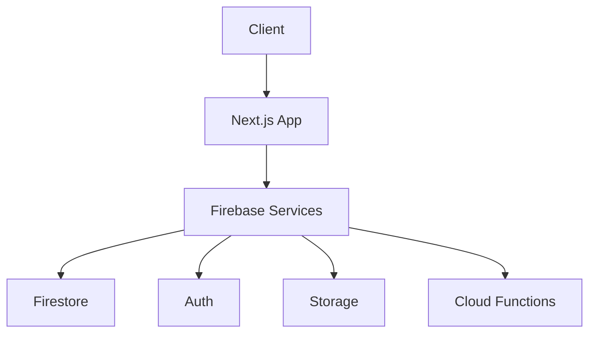
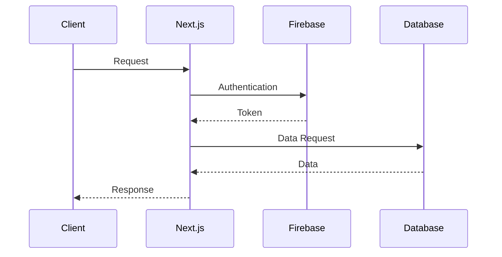
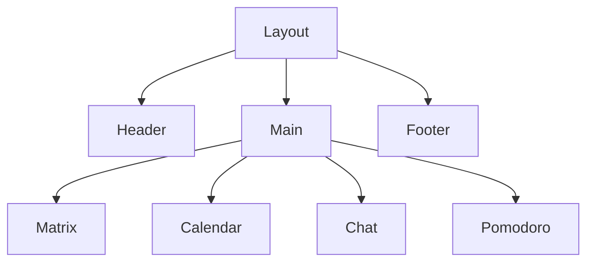
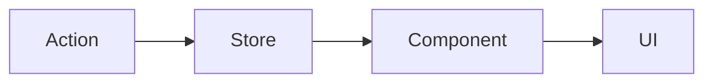
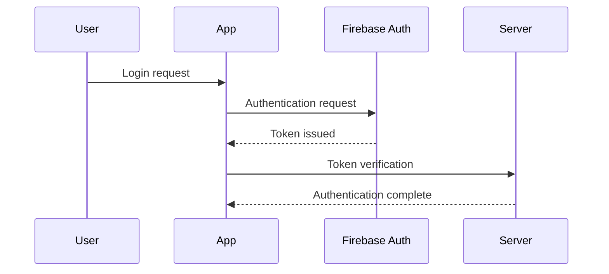

# 🏗 AntiADHD Architecture Documentation

## 1. System Structure

### 1.1 Overall Architecture


### 1.2 Data Flow


## 2. Component Structure

### 2.1 Directory Structure
```
app/
├── components/
│   ├── ui/           # Common UI components
│   ├── matrix/       # Matrix-related components
│   ├── calendar/     # Calendar-related components
│   ├── chat/         # Chat-related components
│   └── pomodoro/     # Pomodoro-related components
├── lib/
│   ├── firebase/     # Firebase settings
│   ├── hooks/        # Custom hooks
│   └── utils/        # Utility functions
└── models/           # Type definitions
```

### 2.2 Component Hierarchy


## 3. State Management

### 3.1 Global State
- **Auth Store**: User authentication state
- **Matrix Store**: Matrix data
- **Calendar Store**: Calendar events
- **Chat Store**: Chat messages
- **Pomodoro Store**: Timer state

### 3.2 State Flow


## 4. Routing Structure

### 4.1 Page Structure
```
/                   # Dashboard
/matrix            # Matrix
/calendar          # Calendar
/chat              # Chat
/pomodoro          # Pomodoro
/settings          # Settings
```

### 4.2 Routing Logic
- Only authenticated users can access
- Supports dynamic routing
- Uses nested routing

## 5. Performance Optimization

### 5.1 Client Side
- Use React.memo
- Optimize with useMemo/useCallback
- Image optimization
- Code splitting

### 5.2 Server Side
- Use SSR/SSG
- Caching strategies
- API route optimization

## 6. Security Structure

### 6.1 Authentication Flow


### 6.2 Data Security
- Firebase Security Rules
- API route security
- CORS settings
- XSS prevention 