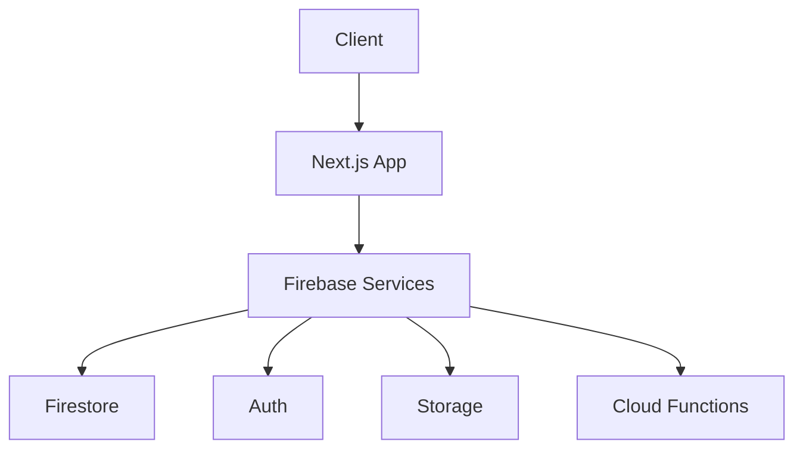
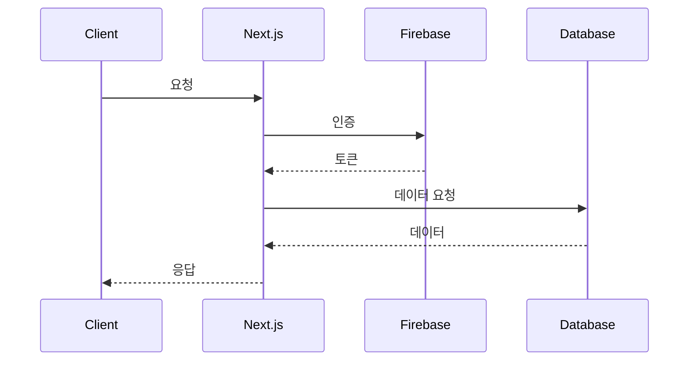
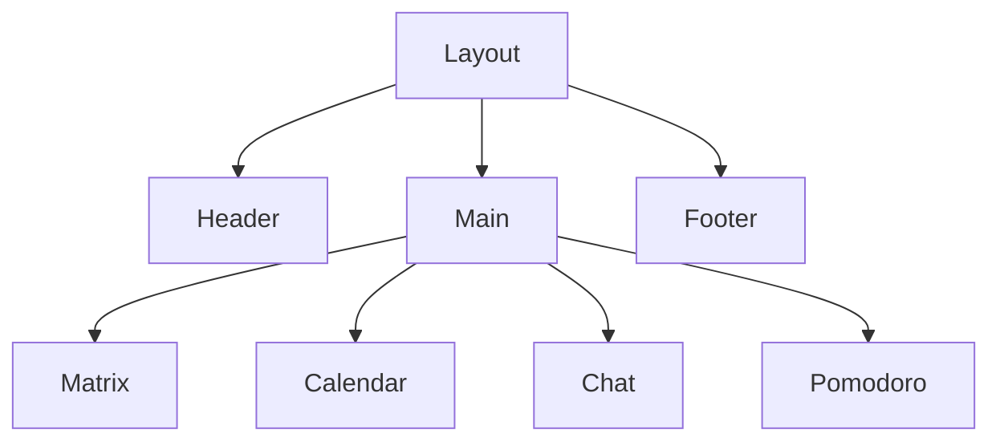
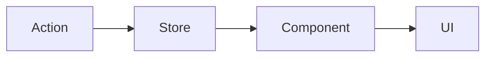
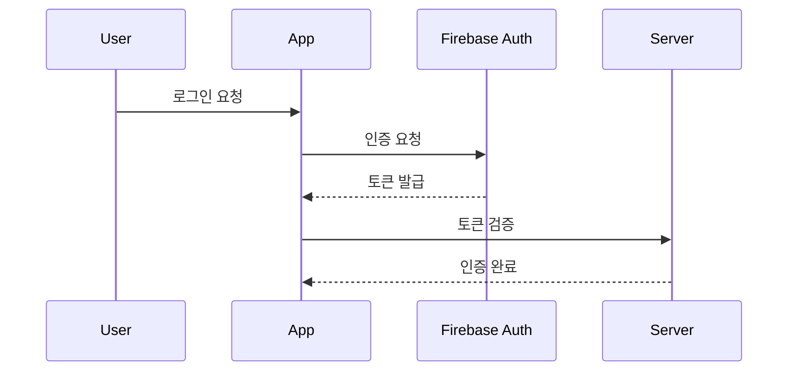

# 🏗 AntiADHD 아키텍처 문서

## 1. 시스템 구조

### 1.1 전체 아키텍처


### 1.2 데이터 흐름


## 2. 컴포넌트 구조

### 2.1 디렉토리 구조
```
app/
├── components/
│   ├── ui/           # 공통 UI 컴포넌트
│   ├── matrix/       # 매트릭스 관련 컴포넌트
│   ├── calendar/     # 캘린더 관련 컴포넌트
│   ├── chat/         # 채팅 관련 컴포넌트
│   └── pomodoro/     # 뽀모도로 관련 컴포넌트
├── lib/
│   ├── firebase/     # Firebase 설정
│   ├── hooks/        # 커스텀 훅
│   └── utils/        # 유틸리티 함수
└── models/           # 타입 정의
```

### 2.2 컴포넌트 계층


## 3. 상태 관리

### 3.1 전역 상태
- **Auth Store**: 사용자 인증 상태
- **Matrix Store**: 매트릭스 데이터
- **Calendar Store**: 캘린더 이벤트
- **Chat Store**: 채팅 메시지
- **Pomodoro Store**: 타이머 상태

### 3.2 상태 흐름


## 4. 라우팅 구조

### 4.1 페이지 구조
```
/                   # 대시보드
/matrix            # 매트릭스
/calendar          # 캘린더
/chat              # 채팅
/pomodoro          # 뽀모도로
/settings          # 설정
```

### 4.2 라우팅 로직
- 인증된 사용자만 접근 가능
- 동적 라우팅 지원
- 중첩 라우팅 사용

## 5. 성능 최적화

### 5.1 클라이언트 사이드
- React.memo 사용
- useMemo/useCallback 최적화
- 이미지 최적화
- 코드 스플리팅

### 5.2 서버 사이드
- SSR/SSG 활용
- 캐싱 전략
- API 라우트 최적화

## 6. 보안 구조

### 6.1 인증 흐름


### 6.2 데이터 보안
- Firebase Security Rules
- API 라우트 보안
- CORS 설정
- XSS 방지
