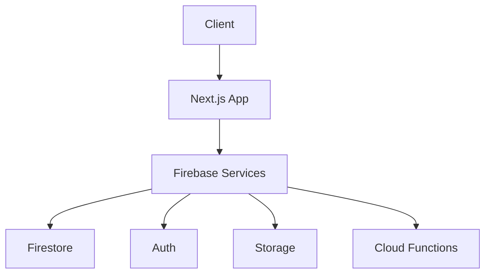

# 🛠 AntiADHD 기술 설계서

## 1. 기술 스택

### Frontend
- **프레임워크**: Next.js 15.2.4
- **언어**: TypeScript
- **스타일링**: Tailwind CSS
- **상태관리**: React Context + Zustand
- **UI 컴포넌트**: shadcn/ui
- **애니메이션**: Framer Motion
- **드래그앤드롭**: react-dnd

### Backend
- **서버리스**: Firebase
- **데이터베이스**: Firestore
- **인증**: Firebase Auth
- **스토리지**: Firebase Storage
- **실시간**: Firestore Realtime
- **푸시알림**: Firebase Cloud Messaging

## 2. 시스템 아키텍처



## 3. 데이터베이스 설계

### Firestore 컬렉션 구조
```typescript
interface Project {
  id: string
  name: string
  ownerId: string
  members: string[]
  settings: ProjectSettings
  createdAt: Timestamp
  updatedAt: Timestamp
}

interface Task {
  id: string
  projectId: string
  title: string
  description: string
  quadrant: 1 | 2 | 3 | 4
  status: 'todo' | 'in-progress' | 'done'
  assignees: string[]
  dueDate: Timestamp
  tags: string[]
  priority: 'low' | 'medium' | 'high'
  createdAt: Timestamp
  updatedAt: Timestamp
}

interface User {
  id: string
  email: string
  displayName: string
  photoURL: string
  projects: string[]
  settings: UserSettings
  createdAt: Timestamp
  updatedAt: Timestamp
}
```

## 4. API 설계

### RESTful 엔드포인트
```typescript
// 프로젝트
GET    /api/projects
POST   /api/projects
GET    /api/projects/:id
PUT    /api/projects/:id
DELETE /api/projects/:id

// 태스크
GET    /api/projects/:projectId/tasks
POST   /api/projects/:projectId/tasks
PUT    /api/projects/:projectId/tasks/:taskId
DELETE /api/projects/:projectId/tasks/:taskId

// 사용자
GET    /api/users/me
PUT    /api/users/me
GET    /api/users/:id
```

### WebSocket 이벤트
```typescript
// 실시간 업데이트
interface RealtimeEvents {
  'task:created': (task: Task) => void
  'task:updated': (task: Task) => void
  'task:deleted': (taskId: string) => void
  'user:typing': (userId: string, isTyping: boolean) => void
  'chat:message': (message: ChatMessage) => void
}
```

## 5. 보안 설계

### Firebase Security Rules
```javascript
rules_version = '2';
service cloud.firestore {
  match /databases/{database}/documents {
    // 프로젝트 접근 제어
    match /projects/{projectId} {
      allow read, write: if isProjectMember(projectId);
      
      // 매트릭스 접근 제어
      match /matrix/{date} {
        allow read, write: if isProjectMember(projectId);
      }
      
      // 채팅 접근 제어
      match /chatMessages/{messageId} {
        allow read: if isProjectMember(projectId);
        allow create: if isProjectMember(projectId);
        allow update, delete: if isMessageOwner(messageId);
      }
    }
  }
}
```

## 6. 성능 최적화

### 프론트엔드
- React.memo, useMemo, useCallback 활용
- 이미지 최적화 (next/image)
- 코드 스플리팅
- 서버 사이드 렌더링

### 백엔드
- Firestore 인덱싱
- 배치 작업
- 캐싱 전략
- 실시간 구독 최적화

## 7. 개발 환경

### 7.1 로컬 개발
```bash
# 의존성 설치
pnpm install

# 개발 서버 실행
pnpm dev

# 빌드
pnpm build

# 테스트
pnpm test
```

### 7.2 환경 변수
```env
# Firebase
NEXT_PUBLIC_FIREBASE_API_KEY=
NEXT_PUBLIC_FIREBASE_AUTH_DOMAIN=
NEXT_PUBLIC_FIREBASE_PROJECT_ID=
NEXT_PUBLIC_FIREBASE_STORAGE_BUCKET=
NEXT_PUBLIC_FIREBASE_MESSAGING_SENDER_ID=
NEXT_PUBLIC_FIREBASE_APP_ID=

# Google Analytics
NEXT_PUBLIC_GA_ID=

# Google AdSense
NEXT_PUBLIC_ADSENSE_CLIENT_ID=
```

## 8. 테스트 전략

### 8.1 단위 테스트
- Jest + React Testing Library
- 컴포넌트 테스트
- 유틸리티 함수 테스트

### 8.2 통합 테스트
- API 엔드포인트 테스트
- Firebase 연동 테스트
- 인증 흐름 테스트

### 8.3 E2E 테스트
- Cypress
- 사용자 시나리오 테스트
- 크로스 브라우저 테스트

# 📅 WBS (Work Breakdown Structure)

## Phase 1: 기반 설정 (2주)
### 1.1 프로젝트 초기화 (3일)
- [x] Next.js 프로젝트 설정
- [x] TypeScript 설정
- [x] Tailwind CSS 설정
- [x] 기본 디렉토리 구조 설정

### 1.2 Firebase 설정 (2일)
- [x] Firebase 프로젝트 생성
- [x] Firestore 설정
- [x] Auth 설정
- [x] Security Rules 설정

### 1.3 기본 UI 컴포넌트 (4일)
- [x] 레이아웃 컴포넌트
- [x] 공통 UI 컴포넌트
- [x] 테마 설정
- [x] 반응형 디자인

## Phase 2: 인증 시스템 (1주)
### 2.1 구글 로그인 (3일)
- [x] Firebase Auth 연동
- [x] 로그인/로그아웃 구현
- [x] 사용자 프로필 관리

### 2.2 권한 관리 (2일)
- [ ] 사용자 역할 설정
- [ ] 접근 제어 구현
- [ ] 보안 규칙 테스트

## Phase 3: 매트릭스 기능 (2주)
### 3.1 기본 구조 (3일)
- [ ] 4분면 레이아웃
- [ ] 태스크 CRUD
- [ ] 상태 관리

### 3.2 드래그앤드롭 (4일)
- [ ] react-dnd 설정
- [ ] 드래그 로직
- [ ] 실시간 동기화
- [ ] 애니메이션

### 3.3 태스크 상세 (3일)
- [ ] 상세 모달
- [ ] 태그 시스템
- [ ] 담당자 지정
- [ ] 마감일 설정

## Phase 4: 캘린더 기능 (1주)
### 4.1 기본 캘린더 (3일)
- [ ] 캘린더 뷰
- [ ] 이벤트 CRUD
- [ ] 반복 일정

### 4.2 통합 (2일)
- [ ] 매트릭스 연동
- [ ] 알림 설정
- [ ] 실시간 동기화

## Phase 5: 채팅 기능 (1주)
### 5.1 실시간 채팅 (3일)
- [ ] 채팅 UI
- [ ] 메시지 전송
- [ ] 실시간 동기화

### 5.2 고급 기능 (2일)
- [ ] 타이핑 표시
- [ ] 파일 첨부
- [ ] 이모지 지원

## Phase 6: 뽀모도로 타이머 (1주)
### 6.1 기본 기능 (3일)
- [x] 타이머 구현
- [x] 세션 관리
- [x] 알림

### 6.2 고급 기능 (2일)
- [ ] 통계
- [ ] 팀 공유
- [ ] 설정

## Phase 7: 테스트 및 최적화 (1주)
### 7.1 테스트 (3일)
- [ ] 단위 테스트
- [ ] 통합 테스트
- [ ] E2E 테스트

### 7.2 최적화 (2일)
- [ ] 성능 최적화
- [ ] 코드 리팩토링
- [ ] 문서화

## Phase 8: 배포 및 모니터링 (1주)
### 8.1 배포 (3일)
- [ ] CI/CD 설정
- [ ] 환경 설정
- [ ] 배포 자동화

### 8.2 모니터링 (2일)
- [ ] 로깅 설정
- [ ] 에러 추적
- [ ] 성능 모니터링

## 총 기간: 10주
- 시작일: 2025-06-13
- 종료일: 2025-07-15

# 📅 빠른 출시 계획 (3주)

## Week 1: 핵심 기능 구현
### Day 1-2: 기반 설정
- [x] Next.js 프로젝트 설정
- [x] Firebase 설정
- [x] 기본 UI 컴포넌트
- [x] 구글 로그인

### Day 3-4: 매트릭스 기능
- [ ] 4분면 레이아웃
- [ ] 드래그앤드롭
- [ ] 태스크 CRUD
- [ ] 실시간 동기화

### Day 5: 뽀모도로 타이머
- [x] 타이머 구현
- [ ] 세션 기록
- [ ] 통계

## Week 2: 부가 기능 구현
### Day 1-2: 캘린더
- [ ] 기본 캘린더
- [ ] 이벤트 CRUD
- [ ] 매트릭스 연동

### Day 3-4: 채팅
- [ ] 실시간 채팅
- [ ] 타이핑 표시
- [ ] 파일 첨부

### Day 5: 최적화
- [ ] 성능 최적화
- [ ] 코드 리팩토링
- [ ] 버그 수정

## Week 3: 출시 준비
### Day 1-2: 테스트
- [ ] 주요 기능 테스트
- [ ] 크로스 브라우저 테스트
- [ ] 모바일 테스트

### Day 3-4: 배포
- [ ] Vercel 배포
- [ ] 도메인 설정
- [ ] SSL 설정

### Day 5: 마케팅
- [ ] 구글 애드센스 설정
- [ ] SEO 최적화
- [ ] 소셜 미디어 공유

# 💰 구글 애드센스 통합

## 1. 사전 요구사항
- [ ] 구글 애드센스 계정 생성
- [ ] 사이트 등록 및 검토
- [ ] 개인정보 처리방침 페이지
- [ ] 쿠키 동의 배너

## 2. 구현 계획
### 광고 유닛 배치
```typescript
// 광고 컴포넌트
interface AdUnit {
  id: string
  type: 'display' | 'in-article' | 'in-feed'
  position: 'header' | 'sidebar' | 'content' | 'footer'
  size: 'responsive' | 'fixed'
}

// 예시 광고 위치
const adPositions = {
  header: {
    type: 'display',
    size: 'responsive'
  },
  matrix: {
    type: 'in-article',
    size: 'fixed'
  },
  sidebar: {
    type: 'display',
    size: 'fixed'
  }
}
```

### 구현 단계
1. **초기 설정**
   - [ ] 애드센스 스크립트 추가
   - [ ] 광고 단위 생성
   - [ ] 테스트 광고 표시

2. **광고 컴포넌트**
   ```typescript
   // components/ads/AdUnit.tsx
   const AdUnit: React.FC<AdUnitProps> = ({ id, type, position }) => {
     useEffect(() => {
       // 광고 로드 로직
     }, [])
     
     return (
       <div className={`ad-unit ad-${position}`}>
         <ins className="adsbygoogle"
           style={{ display: 'block' }}
           data-ad-client="ca-pub-XXXXXXXXXXXXXXXX"
           data-ad-slot={id}
           data-ad-format="auto"
           data-full-width-responsive="true" />
       </div>
     )
   }
   ```

3. **광고 정책 준수**
   - [ ] 광고 밀도 제한 (최대 3개/페이지)
   - [ ] 콘텐츠 대비 광고 비율
   - [ ] 모바일 최적화

4. **수익 최적화**
   - [ ] A/B 테스트
   - [ ] 광고 위치 최적화
   - [ ] 사용자 경험 모니터링

## 3. 수익화 전략
1. **광고 유형**
   - 디스플레이 광고
   - 인피드 광고
   - 반응형 광고

2. **위치 최적화**
   - 헤더
   - 매트릭스 사이드
   - 콘텐츠 중간
   - 푸터

3. **사용자 경험**
   - 광고 차단 감지
   - 로딩 최적화
   - 모바일 대응

## 4. 모니터링
- [ ] 애드센스 대시보드 연동
- [ ] 수익 추적
- [ ] 사용자 행동 분석
- [ ] 광고 성과 리포트

## 5. 준수사항
- [ ] 개인정보 처리방침
- [ ] 쿠키 정책
- [ ] 광고 정책
- [ ] 접근성 가이드라인 

## 5. 개발 환경

### 5.1 로컬 개발
```bash
# 의존성 설치
pnpm install

# 개발 서버 실행
pnpm dev

# 빌드
pnpm build

# 테스트
pnpm test
```

### 5.2 환경 변수
```env
# Firebase
NEXT_PUBLIC_FIREBASE_API_KEY=
NEXT_PUBLIC_FIREBASE_AUTH_DOMAIN=
NEXT_PUBLIC_FIREBASE_PROJECT_ID=
NEXT_PUBLIC_FIREBASE_STORAGE_BUCKET=
NEXT_PUBLIC_FIREBASE_MESSAGING_SENDER_ID=
NEXT_PUBLIC_FIREBASE_APP_ID=

# Google Analytics
NEXT_PUBLIC_GA_ID=

# Google AdSense
NEXT_PUBLIC_ADSENSE_CLIENT_ID=
```

## 6. 테스트 전략

### 6.1 단위 테스트
- Jest + React Testing Library
- 컴포넌트 테스트
- 유틸리티 함수 테스트

### 6.2 통합 테스트
- API 엔드포인트 테스트
- Firebase 연동 테스트
- 인증 흐름 테스트

### 6.3 E2E 테스트
- Cypress
- 사용자 시나리오 테스트
- 크로스 브라우저 테스트 